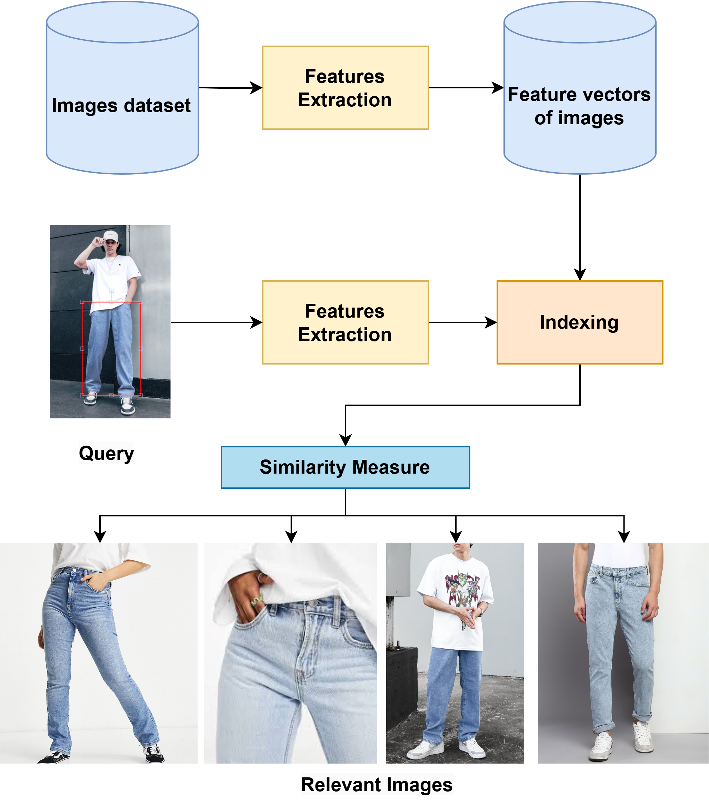
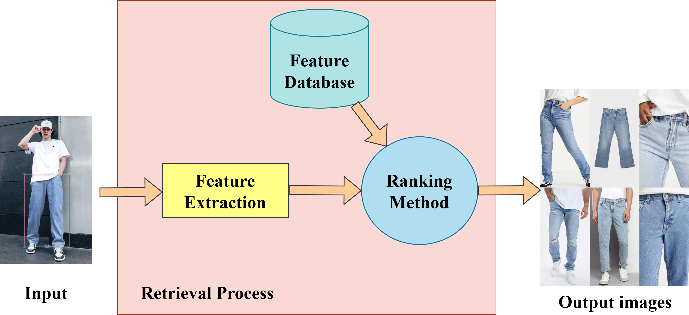
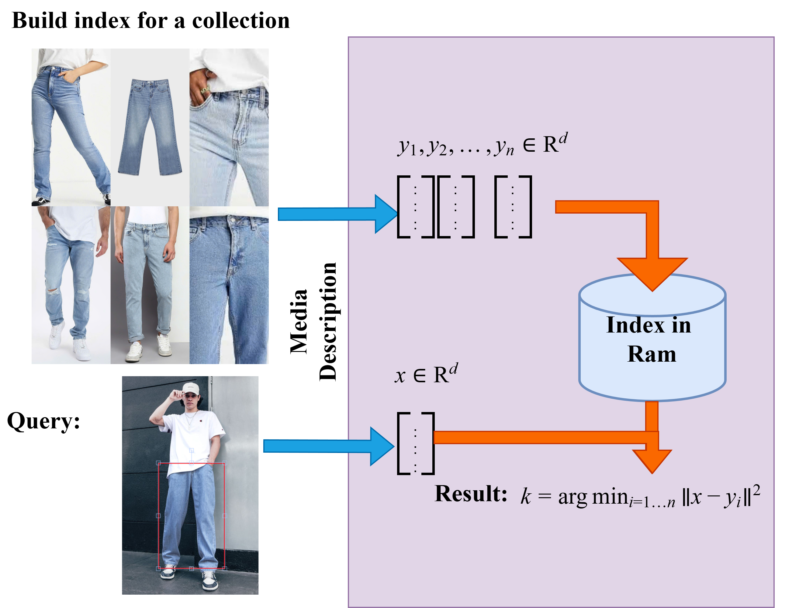
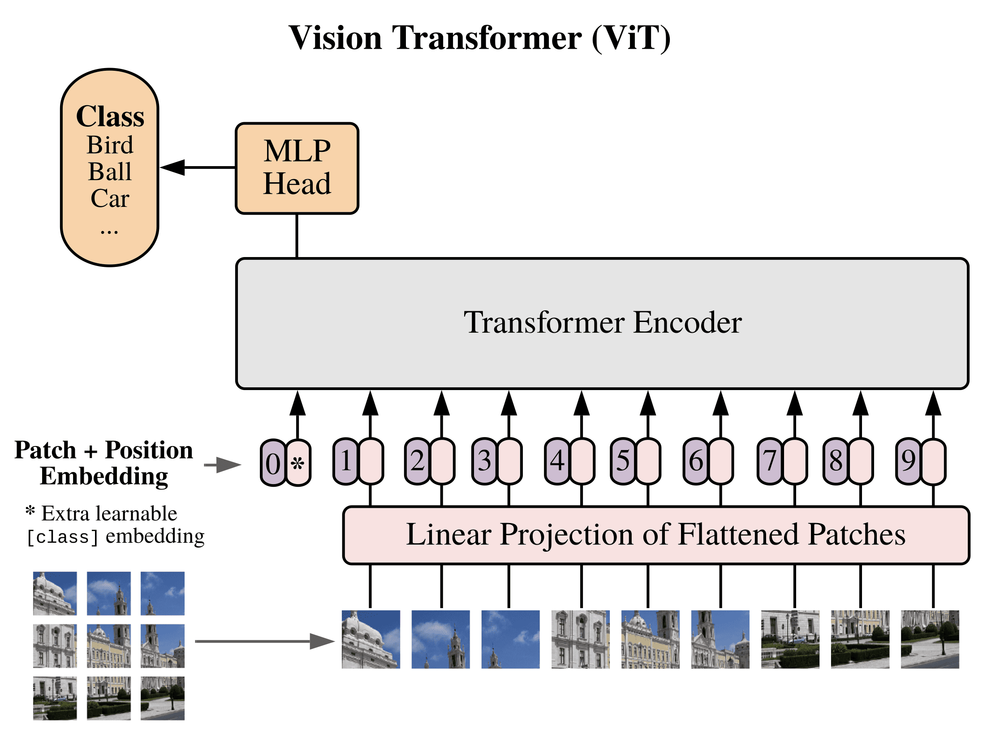
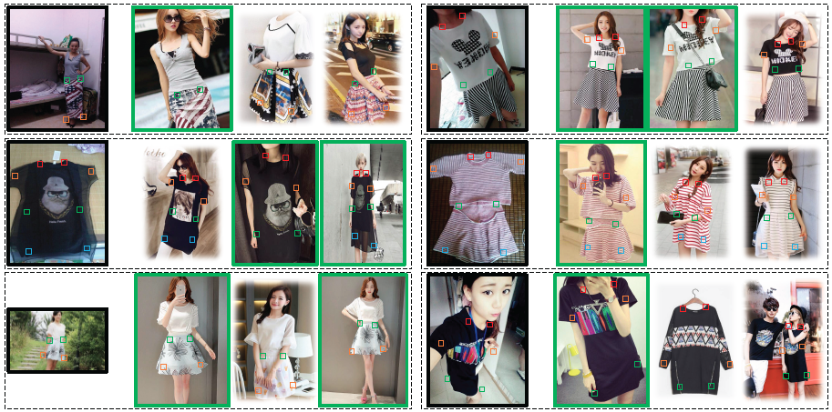

# Vision Transformer for Fashion Image Retrieval: A Comprehensive Evaluation on Real-World Datasets

[](https://doi.org/10.5281/zenodo.15151481)

## Abstract

This research presents a comprehensive evaluation of Content-Based Image Retrieval (CBIR) for fashion images, comparing traditional computer vision techniques with modern deep learning approaches. We introduce a novel implementation combining Vision Transformers (ViT) with Facebook AI Similarity Search (FAISS) for efficient similarity search. Our experimental results on both the Deep Fashion Dataset (239,557 images) and VNIU-VNR50 Dataset (1,311 images) demonstrate the superiority of ViT-based features, achieving mAP scores of 0.689 and 0.791 respectively.

## System Architecture

### System Overview



### Input/Output Flow



### FAISS Indexing Architecture



Our system follows a two-phase approach:

1. **Indexing Phase:**

   ```
   Input: Database Images
   ↓
   Feature Extraction (ViT/ResNet50/EfficientNetV2)
   ↓
   FAISS Index Construction
   ↓
   Output: Indexed Features Database
   ```

2. **Retrieval Phase:**
   ```
   Input: Query Image
   ↓
   Feature Extraction
   ↓
   FAISS Similarity Search
   ↓
   Output: Ranked List of Similar Images
   ```

### Vision Transformer (ViT) Architecture



Our implementation uses ViT-B/16 with the following specifications:

- Patch size: 16x16 pixels
- Hidden dimension: 768
- MLP size: 3072
- Number of heads: 12
- Number of layers: 12
- Input resolution: 224x224
- Total parameters: 86M

Key features:

- Pre-trained on ImageNet-1K
- Fine-tuned for fashion domain
- CLS token used for final image representation

### FAISS Implementation Details

We utilize FAISS for efficient similarity search with the following configuration:

```python
def get_faiss_indexer(shape):

    indexer = faiss.IndexFlatL2(shape) # features.shape[1]
    return indexer
```

Key components:

- **IndexFlatL2**: Base quantizer using L2 distance
- **Training**: Performed on a subset of database vectors
- **GPU Acceleration**: Enabled for faster search

## Experimental Results

### Dataset Overview

1. **Deep Fashion Dataset Examples**



2. **VNIU-VNR50 Dataset Examples**

 

1. **Deep Fashion Dataset:**

   - 239,557 fashion images
   - Consumer-to-shop pairs
   - Multiple views and poses

2. **VNIU-VNR50 Dataset:**
   - 1,311 fashion items
   - Clean, studio-quality images
   - Single view per item

### Performance Metrics

#### Deep Fashion Dataset Results

| Method         | Indexing (s) | Evaluate (s) | Retrieve (s) | mAP   |
| -------------- | ------------ | ------------ | ------------ | ----- |
| RGB Histogram  | 16,340.03    | 43.467       | 13.088       | 0.439 |
| LBP            | 38,002.902   | 8.492        | 12.791       | 0.385 |
| ResNet50       | 61,564.061   | 132.337      | 11.483       | 0.679 |
| EfficientNetV2 | 63,914.953   | 75.518       | 9.832        | 0.621 |
| ViT            | 121,834.871  | 96.655       | 8.910        | 0.689 |

#### VNIU-VNR50 Dataset Results

| Method         | Indexing (s) | Evaluate (s) | Retrieve (s) | mAP   |
| -------------- | ------------ | ------------ | ------------ | ----- |
| RGB Histogram  | 17.997       | 0.593        | 0.023        | 0.768 |
| LBP            | 38.373       | 1.651        | 0.056        | 0.601 |
| ResNet50       | 93.123       | 4.342        | 0.523        | 0.750 |
| EfficientNetV2 | 85.161       | 4.950        | 0.694        | 0.766 |
| ViT            | 466.702      | 22.054       | 1.744        | 0.791 |

## Usage Guide

### Installation

1. Set up the environment:

```bash
# Create and activate conda environment
conda create -n fashion-retrieval python=3.10
conda activate fashion-retrieval

# Install PyTorch with CUDA support
conda install pytorch torchvision torchaudio pytorch-cuda=11.7 -c pytorch -c nvidia

# Install FAISS
conda install -c conda-forge faiss-gpu

# Install other dependencies
pip install -r requirements.txt
```

### Dataset Preparation

1. Download and organize dataset:

```bash
dataset/
├── cloth/              # Fashion images
├── groundtruth/        # Query information
├── feature/           # Feature indexes
└── evaluation/        # Results
```

2. Process images:

```python
# Expected format for groundtruth files
image_name left top right bottom
```

### Running the System

1. Extract features:

```bash
python indexing.py --feature_extractor VIT \
                  --image_root dataset/cloth \
                  --feature_root dataset/feature
```

2. Run evaluation and compute metrics:

```bash
# Step 1: Generate ranked lists for evaluation
python ranking.py --feature_extractor VIT \
                 --query_root dataset/groundtruth \
                 --top_k 11

# Step 2: Compute mAP scores
python compute.py --feature_extractor VIT

# Optional: Evaluate with cropped images
python compute.py --feature_extractor VIT --crop True

# Results will show mAP scores as reported in our paper:
# Deep Fashion Dataset: mAP = 0.689
# VNIU-VNR50 Dataset: mAP = 0.791
```

3. Launch demo interface:

```bash
streamlit run demo.py
```

### Interactive Demo


## Technical Details

### Input/Output Specifications

1. **Input Images:**

   - Format: RGB, JPEG/PNG
   - Resolution: 224x224 pixels
   - Color space: RGB
   - Preprocessing: Center crop, normalization

2. **Feature Vectors:**

   - ViT: 768-dimensional
   - Format: Float32 numpy array
   - Normalization: L2-normalized

3. **Query Format:**
   - Image file
   - Optional bounding box coordinates
   - Supports cropped region search

### Key Components

1. **Feature Extraction (ViT):**

```python
def extract_features(image):
    # Preprocess image
    image = preprocess(image)

    # Extract patch embeddings
    patches = self.patch_embed(image)

    # Add position embeddings
    tokens = self.pos_drop(patches + self.pos_embed)

    # Transform through layers
    for blk in self.blocks:
        tokens = blk(tokens)

    # Get CLS token embedding
    features = tokens[:, 0]

    return features
```

2. **FAISS Search:**

```python
def search_similar(query_vector, k=10):
    # L2 normalize query vector
    query_vector = normalize(query_vector)

    # Perform k-NN search
    distances, indices = index.search(query_vector, k)

    return indices
```

## Best Practices

1. **Performance Optimization:**

   - Use GPU acceleration
   - Batch process images
   - Precompute and cache features

2. **Quality Control:**

   - Monitor GPU memory usage
   - Validate feature extraction
   - Check evaluation metrics

3. **Error Handling:**
   - Verify input formats
   - Handle missing files
   - Manage memory efficiently

## Citation

If you use this code or findings in your research, please cite:

```bibtex
@article{10.5281/zenodo.15151481,
    title={Vision Transformer for Fashion Image Retrieval: A Comprehensive Evaluation on Real-World Datasets},
    author={Truc Nguyen, Ninh Nguyen, Vu Tran, Qui Nguyen, Trinh Huynh},
    journal={The Visual Computer},
    year={2025},
    publisher={Springer}
}
```

## License

This project is licensed under the MIT License - see the [LICENSE](LICENSE) file for details.

## Acknowledgments

- Deep Fashion Dataset from MMLAB, CUHK
- FAISS library from Facebook Research
- PyTorch team for ViT implementation
